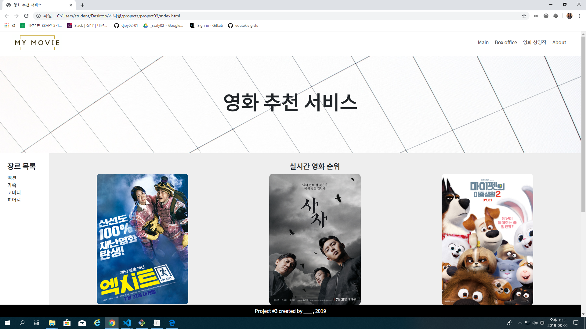
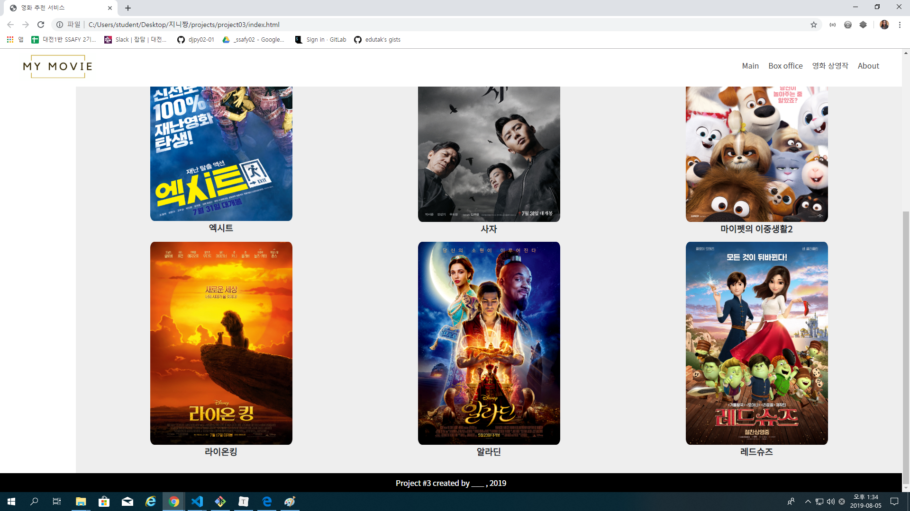

```css
aside {
  /* aside를 부모인 div#content의 영역에 위치시키세요.
  div#content는 position: relative 입니다.
  */
  position: relative;
  top: 0;
  /* bottom: 0; */
}
```

* position : relative vs absolute

* position : fixed vs sticky
* 텍스트 수직 정렬
  * line-height: 글씨 크기만큼.
  * 글씨 길어지면 넘어가버림. 이런것도 생각해줘야.
* css 공부법
  * 사이트 펴놓고 똑같이 만들어보기


# 03 - Web(HTML/CSS를 활용한 웹 사이트 구성)

## 요구사항

* HTML/CSS를 활용해 웹 사이트의 레이아웃을 구성합니다.

1. `header`

   로고 이미지와 네비게이션 바를 구성합니다.

2. title `section`

   * 

3. `aside`

4. movie `section`

5. `footer`

* 소스보기
  * [index.html](./index.html)
  * [reboot.css](reboot.css)
  * [style.css](style.css)
  * [layout.css](./layout.css)

* 결과 스크린샷

  

  

  

  