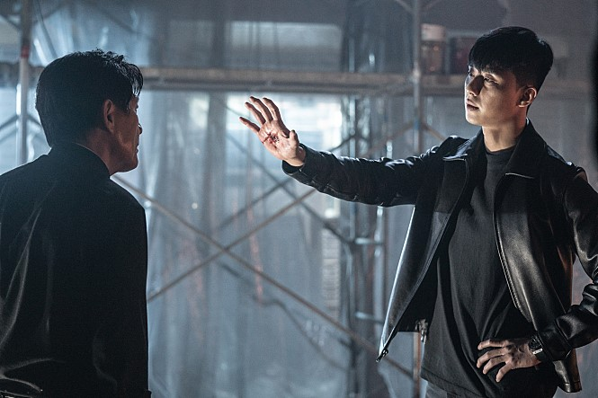
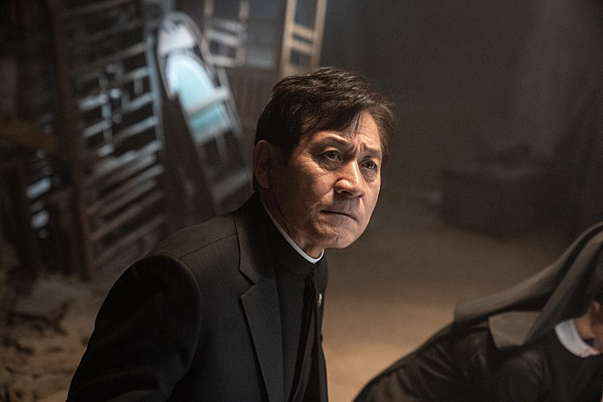
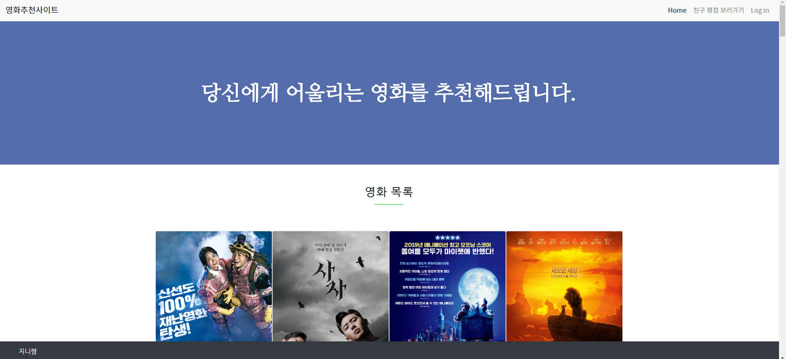

# 04 - Web(반응형 웹 사이트 구성)

## 1. 목표

- HTML를 통한 웹 페이지 마크업
- CSS를 통한 선택자 활용 및 웹 페이지 꾸미기
- Bootstrap을 활용한 HTML/CSS, JS 라이브러리 활용
- 영화 추천 사이트 반응형 레이아웃 구성

## 2. 준비 사항

1. **(필수)** HTML/CSS, Bootstrap 환경 구성

   - Text Editor(자유)
   - [Bootstrap v.4.3.1](https://getbootstrap.com/)

2. **(필수)** 웹 페이지를 위한 Assets 다운로드

   - `images` 폴더에는 활용할 포스터 이미지가 있습니다.
   - `data.csv`에는 프로젝트 #1 및 #2에서 수집한 데이터의 일부가 들어 있습니다.

3. (선택) 아래의 링크는 홈페이지를 만드는 과정에서 선택적으로 활용하셔도 됩니다.

   - [font-awesome](https://fontawesome.com/)

     - font awesome은 웹 개발과정에서 많이 활용되는 아이콘들을 css 혹은 svg 형태로 제공합니다.

       ```
       https://use.fontawesome.com/releases/v5.10.1/css/all.css
       ```

   - [animate-css](https://daneden.github.io/animate.css/)

     - Animate.css는 CSS를 활용한 애니메이션을 제공합니다.

## 3. 요구 사항

- HTML/CSS와 Bootstrap을 활용하여 목표로 하는 반응형 웹사이트를 구성한다.

  **HTML 파일과 CSS파일은 별도로 분리하여, 반드시 정해진 이름으로 작성하세요.**

1. **영화 추천 사이트를 위한 레이아웃 구성(1)**

   * 영화 추천 사이트 메인 페이지 기초 레이아웃을 구성합니다.

   * [01_layout.html](./01_layout.html)

   * [01_layout.css](01_layout.css)

     1. **(필수)** HTML 기초

        1. **필수 사항**
           - `DOCTYPE`은 html입니다.
           - `html`의 언어는 한국어(ko)입니다. 
           - `meta` 태그에 인코딩 설정을 UTF-8로 설정 해주세요. 
           - `meta` 태그에 기본 viewport 설정을 해주세요. (width: device-width, initialscale: 1.0)
           - `title` 태그는 영화추천사이트 라고 설정 해주세요.

        ```html
        <!DOCTYPE html>
        <html lang="ko">
        <head>
         <meta charset="UTF-8">
         <meta name="viewport" content="width=device-width, initial-scale=1.0">
         <meta http-equiv="X-UA-Compatible" content="ie=edge">
         <title>영화추천사이트</title></head>
         <body>
             
         </body>
        </html>
        ```

     2. **(필수)** Navigation Bar

        1. **필수 사항**

           * **최상단**에 위치해야합니다.

           * Item List(예시 - Home/친구평점보러가기/Login)는 **우측 정렬**입니다. 

           * **반응형**으로 구성되어 일정 수준 이하에서는 item이 숨김 처리 됩니다. 

           * **Sticky navigation bar**로 구성됩니다. 

             * Sticky 혹은 fixed position이란, 웹 UI 패턴에서 스크롤을 아래로 내리더라도 특정 위치에 고정되어 있는 형태를 뜻합니다. 
               드랍박스, 구 검색결과를 들어가서 스크롤을 내리면 상단에 navigation bar가 고정되어 있는 것을 볼 수 있습니다. 

             * 확인 방법

               ```html
               body { 
               /* body태그의 높이를 지정하여 스크롤을 만들고, 
               스크롤을 내리면 Navigation bar가 상단에 고정되어있는지 확인해보세요. 
               */  
               	height: 10000px; 
               }
               ```

            * Item List에서 Home을 제외한 것들은 아직 기능이 구현되어 있지 않으므로 **클릭이 불 가능(disable)**합니다. 

        2. 선택 사항

           * **1.필수 사항** 제외한 모든 내용 자유롭게 구성 가능
           * Navbar 및 글씨 색상, 좌측 로그 등

        ```html
        <!-- 
        sticky-top:
        최상단에 위치 
        Sticky navigation bar
        -->
        <nav class="navbar navbar-expand-lg navbar-light bg-light sticky-top">
          <a class="navbar-brand" href="#">영화추천사이트</a>
          <!-- 
            justify-content-end:
            Item List 우측 정렬 
          -->
          <div class="collapse navbar-collapse mr-auto justify-content-end" id="navbarSupportedContent">
            <ul class="navbar-nav">
              <li class="nav-item active">
                <a class="nav-link" href="#">Home <span class="sr-only">(current)</span></a>
              </li>
              <li class="nav-item">
              <!-- '친구 평점 보러가기, log in' 링크 사용 못하게.
                tabindex: 키보드 접근성에 근접한 속성
                -1: 탭 키에 대해 포커스 해제 
                aria-disabled: 엘리먼트 감지 되지만 비활성화, 동작 안됨
              -->
                <a class="nav-link" href="#" tabindex="-1" aria-disabled="true">친구 평점 보러가기</a>
              </li>
              <li class="nav-item">
                <a class="nav-link" href="#" tabindex="-1" aria-disabled="true">Log in</a>
              </li>
            </ul>
          </div>
        </nav>
        ```

        ```css
        nav a, title {
          font-family: 'Noto Sans KR', sans-serif;
        }
        ```

     3. **(필수)** Header

        1. **필수 사항**
           * Navigation Bar 바로 아래에 위치합니다. 
           * 높이는**350px **, 너비는 **브라우저 전체 영역**입니다. 
           * 이미지는 선택적으로 활용 가능하되 반드시 **배경 이미지**가 있어야 합니다.
           * Header 영역의 **수직/수평 가운데 정렬 위치**에 `h2` 태그를 사용하여 작성해주세요.
        2. 선택 사항
           * **1. 필수 사항**을 제외한 모든 내용은 자유롭게 구성할 수 있습니다. 
           * Header 배경 이미지, 색상 필터 등은 자유롭게 해주세요. 
           * 배경 이미지와 관련하여 (css 속성 background-* 를 활용해 보세요.)

        ```html
        <header id="up">
            <h2 class="text-white">당신에게 어울리는 영화를 추천해드립니다.</h2>
        </header>
        ```

        ```css
        header {
          height: 350px;
          width: 100%;
          background-image: url("./images/배경이미지.jpg");
        }
        ```

     4. **(필수)** Footer

        1. **필수 사항**

           * 브라우저 최하단에 위치합니다. 

             옵션 중 선택 - 1) Sticky  2) 내용 최하단 

           * 높이는 **50px 이상**, 너비는 **브라우저 전체 영역**입니다.

           * 왼쪽에는 **본인의 이름 혹은 닉네임**, 오른쪽에는 **헤더로 올라가는 링크**로 구성됩니다.

           * Footer는 padding이 좌우로 3rem 

        2. 선택 사항

           * **1. 필수 사항**을 제외한 모든 내용은 자유롭게 구성할 수 있습니다. 
           * 상단으로 올라가는 링크 혹은 버튼은 자유롭게 구성 해주세요. 단순 텍스트여도 상관없습니다. 
           * 추가적인 내용은 자유롭게 구성 가능합니다.

        ```html
        <!-- footer
          브라우저 최하단에 위치
          padding이 좌우로 3rem
        -->
        <footer class="fixed-bottom px-5 bg-dark">
          <p class="text-white">지니짱</p>
          <a href="#up"></a>
        </footer>
        ```

        ```css
        /* 
          높이는 50px 이상
          너비는 브라우저 전체 영역 
        */
        footer {
          height: 50px;
          width: 100%;
        }
        
        footer > a {
          position: fixed;
          bottom: 0;
          right: 0;
          height: 50px;
          width: 50px;
          z-index: 1000;
        }
        
        footer > img {
          color: white;
          z-index: 1000;
        }
        ```

     5. **(필수)** Font 설정

        1. **필수 사항 안내**
           * 서로 다른 폰트를 **2개 이상** 활용해보세요.
           * 참고 : [구글폰트](https://fonts.google.com/)
        
        ```css
        header h2 {
          line-height:350px;
          font-size: 50px;
          font-weight: bold;
          text-align: center;
          font-family: 'Nanum Myeongjo', serif;
        }
        
        footer > p {
          line-height: 50px;
          display: float;
          font-family: 'Nanum Gothic', sans-serif;
        }
        ```

2. **영화 추천 사이트를 위한 영화 리스트 구성(2)**

   * 영화 목록 섹션 레이아웃을 만들어봅시다.

   * [02_movie.html](02_movie.html)

   * [02_movie.css](02_movie.css) (내용 없음)

     1. **(필수) 레이아웃**

        1. **필수 사항**
           * 영화 리스트는 **container**에 속합니다. 
        2. 선택 사항
           * **1. 필수 사항**을 제외한 모든 내용은 자유롭게 구성할 수 있습니다. 
           * 배경 색상 등 자유롭게 해주세요. 

        ```html
        <div class="container">
            ... (영화 리스트)
        </div>
        ```
        
     2. **(필수) subtitle**
     
           1. **필수 사항**
              * subtitle 영역은 위 아래 margin이 **3rem**입니다. 
              * 글씨 부분은 `h3` 태그입니다.
              * 밑줄은 너비가  70px이고, 색상은 자유롭게 해주세요. 
           2. 선택 사항
              * **1. 필수 사항**을 제외한 모든 내용은 자유롭게 구성할 수 있습니다. 
              * 추가 문구 등 자유롭게 해주세요.
        ```html
     <!-- 에러!!
       hr태그는 아래와 같이 하면 color 적용이 안된다. 
     -->
     <hr style="width: 70px; color:#D35400;">
        
     <!-- 아래와 같이 쓸 것 -->
     <hr style="width: 70px;" color="#D35400;">   
     <div class="container">
       <!-- subtitle
         밑줄 너비 70px
       -->
       <div class="my-5 text-center">
         <h3>영화 목록</h3>
         <hr style="width: 70px;" color="#grey;">
       </div>
     </div>
        ```
     
     3. **(필수) Card view**
     
        1. **필수 사항**
     
           * 카드 총 6개 이상이며,  반응형으로 배치해야 합니다. 
     
             한 줄에 보이는 카드의 갯수는 다음과 같이 구성됩니다. 
           
             * 576px 미만 : 1개 `col-12`
             * 576px 이상 768px 미만 : 2개  `col-sm-6`
             * 768px 이상 992px 미만 : 3개 `col-md-4`
             * 992px 이상 : 4개 `col-lg-3`
           
           * 카드는 각각 위 아래 margin이 **1rem**입니다. 
           
           * 이미지는 **제공된 이미지**를 활용 해주세요. 
           
             * 이미지는 **반드시** `alt 속성`에 값이 있어야 합니다. 
               * img의 `alt` 속성은 alternate의 약자로, 이미지의 대안을 나타냅니다. 이미지가 서버 혹은 경로 오류로 인해 읽어 오지 못할 경우 해당 속성값이 대체하여 나타납니다. 
             * 이미지 밑에는 `h4` 태그를 활용하여 **영화 제목**을 작성 해주세요. 
           * 영화 제목 옆에는 **네이버 영화 평점**을 작성 해주세요. 
             
               * 영화 평점은 9점 이상인 경우 청색 계열의 색으로, 9점 미만인 경우는 어두운 계열의 색으로 꾸며 주세요. 
     * 제목 및 평점과 내용에는 **구분선**이 있습니다. 
             * 구분선 아래에는 **영화 장르와 개봉일**을 작성 해주세요. 
             * 가장 아래에는 네이버 영화 상세 정보 링크를 만들어 주세요. 
               * 링크는 반드시 새 창에서 열려야 합니다. 
         
        2. 선택 사항 
     
           * **1. 필수 사항**을 포함한 추가적인 내용은 자유롭게 작성 가능합니다. 
           * Card는 bootstrap을 활용하지 않고 직접 만들어도 됩니다. ( 단, grid 규칙은 반드시 지켜야 합니다.) 
           * 영화의 개수를 추가적으로 늘리는 것은 상관 없습니다. 
           * Card에 추가적인 정보를 표현해도 됩니다.
        ```html
        <div class="row"> <!-- 한 줄로 보이게 해줌. row 안쓰면 1컬럼으로 출력 -->
          <!-- card view
              576px 미만 : 1개 
              576px 이상 768px 미만 : 2개 
              768px 이상 992px 미만 : 3개 
              992px 이상 : 4개
              카드는 각각 위 아래 margin이 1rem => my-3
           -->
            <div class="card col-12 col-sm-6 col-md-4 col-lg-3 my-3 p-0" style="width: 18rem;">
              <!-- 이미지 alt 필수 -->
              
              <div class="card-body">
              <!-- h4 태그로 영화 제목 
                영화 평점 9점 이상:청색, 9점 미만 어두운 색
        
                badge: labeling
              badge badge-secondary: 어두운 
                badge badge-info: 청록색
            -->
              <h4 class="card-title">엑시트<br><span class="badge badge-info">9.07</span></h4>
              <hr>
              <p class="card-text">코미디<br>개봉일: 2019.07.31.</p>
              <!-- target="_blank" 링크 새창에서 열기 -->
              <a href="https://movie.naver.com/movie/bi/mi/basic.nhn?code=174903 " target="_blank" class="btn btn-success">영화정보 보러가기</a>
         </div>
          </div>
     </div>
        ```
   
3. **영화 상세 보기**

   * 영화 상세 보기 레이아웃을 만들어 봅시다.

   * [03_detail_view.html](03_detail_view.html)

   * [03_detail_view.css](03_detail_view.css) (내용 없음)

     1. **(필수) Modal**

        **이미지를 클릭하면, 영화에 대한 상세 정보와 추가 이미지를  보여주도록 구성해봅시다.**

        * 앞서 만든 카드뷰의 이미지를 클릭하면 modal이 뜨도록 구성 해보세요. 아래 설명 참조

          ```html
          <!-- Modal은 클릭 대상에 다음과 같이 설정 되어야합니다.     
            data-target : modal의 id     
            data-toggle : modal     
          -->    
              
          <!-- Modal -->
          ```

        * Modal의 상단(.modal-header .modal-title)에는 영화의 한글명과 영문명을 같이 작성해 주세요. 

          * Modal의 헤더(.modal-header)와 내용(.modal-body) 사이에 이미지를 삽입해주세요. 
            * (선택) 이미지 대신 carousel로 구성 해도 됩니다. 
          * Modal의 내용에는 자유롭게 구성해주세요.

     2. 선택 사항

        * **1. 필수사항**을 포함한 추가적인 내용은 자유롭게 작성가능합니다.
        * Modal은 자유롭게 레이아웃을 변경해도 됩니다.
     
     ```html
     <div class="card col-12 col-sm-6 col-md-4 col-lg-3 my-3 p-0 ">
       <!-- style="cursor:pointer; 이미지 위에 커서 올렸을 때 모양 바꾸기 -->
       
       <!-- modal
         이미지를 클릭하면 modal이 뜨도록 하기 위해 이미지 다음에 추가된다.
         img의 data-target: modal의 id, data-toggle: modal
         img의 data-target, modal의 id 맞춰주기
         modal의 aria-labelledby, modal-title의 id 맞춰주기
       -->
       <div class="modal fade" id="movie2" tabindex="-1" role="dialog" aria-labelledby="ModalLabel2"
              aria-hidden="true">
         <div class="modal-dialog" role="document">
           <div class="modal-content">
             <div class="modal-header">
               <!-- modal title은 영화의 한글명, 영문명 -->
               <h5 class="modal-title" id="ModalLabel2">사자, The Divine Fury</h5>
                 <button type="button" class="close" data-dismiss="modal" aria-label="Close">
                   <span aria-hidden="true">&times;</span>
                 </button>
               </div>
               <div class="modal-body
                 <!-- carousel
                   이미지를 슬라이드처럼 넘겨볼 수 있음
                   id와 prev, next 버튼 링크의 href 맞춰주기
                   만약 다르다면 슬라이드가 넘어가지 않는다!
                 -->
                <div id="carouselIndicators2" class="carousel slide" data-ride="carousel">
                 <div class="carousel-inner">
                   <div class="carousel-item active">
                      
                   </div>
                 <div class="carousel-item">
                      
                 </div>
                 <div class="carousel-item">
                    img src="./images/20180442-03.jpg" class="d-block w-100" alt="배우우도환">
                 </div>
               </div>
               <a class="carousel-control-prev" href="#carouselIndicators2" role="button" data-slide="prev">
                 <span class="carousel-control-prev-icon" aria-hidden="true"></span>
                 <span class="sr-only">Previous</span>
               </a>
               <a class="carousel-control-next" href="#carouselIndicators2" role="button" data-slide="next">
                 <span class="carousel-control-next-icon" aria-hidden="true"></span>
                    <span class="sr-only">Next</span>
                 </a>
                 <hr>
               </div>
               <div>
                 <span>15세 관람가</span><br>
                 <span>누적 관람객 : 1,546,259명</span>
                 <hr>
               </div>
               <div>
                 <span>줄거리</span>
                 <span>어릴 적 아버지를 잃은 뒤 세상에 대한 불신만 남은 격투기 챔피언 ‘용후’(박서준). 어느 날 원인을 알 수 없는 깊은 상처가 손바닥에 생긴 것을 발견하고, 도움을 줄 누군가가 있다는 장소로 향한다. 그곳에서 바티칸에서 온 구마사제 ‘안신부’(안성기)를 만나 자신의 상처 난 손에 특별한 힘이 있음을 깨닫게 되는 ‘용후’. 이를 통해 세상을 혼란에 빠뜨리는 악(惡)의 존재를 알게 되고, 강력한 배후이자 악을 퍼뜨리는 검은 주교 ‘지신’(우도환)을 찾아 나선 ‘안신부’와 함께 하게 되는데...! 악의 편에 설 것인가 악에 맞설 것인가 신의 사자가 온다!
                 </span>
               </div>
             </div>
             <div class="modal-footer">
               <button type="button" class="btn btn-secondary" data-dismiss="modal">닫기</button>
             </div>
           </div>
         </div>
       </div>
       <div class="card-body">
         <h4 class="card-title">사자<br><span class="badge badge-secondary">8.32</span></h4>
         <hr>
         <p class="card-text">미스터리<br>개봉일: 2019.07.31.</p>
         <a href="https://movie.naver.com/movie/bi/mi/basic.nhn?code=178544" target="_blank"
                class="btn btn-success">영화정보
                 보러가기</a>
       </div>
     </div>
     ```
     
     

